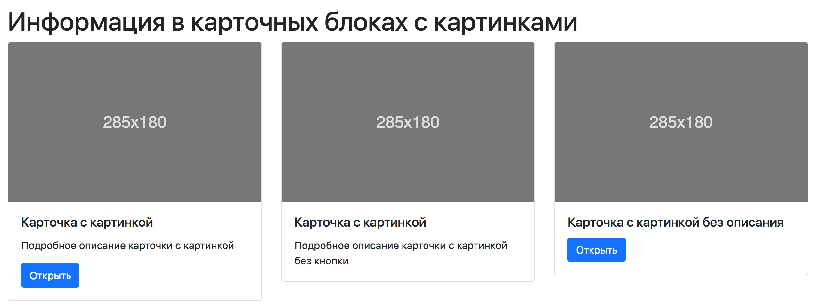

# Документация по заготовкам дизайн-линий

# Навигация
1. [Основная идея методологии](#1-Основная-идея-методологии)
2. [Надстройка для bootstrap](#2-Надстройка-для-bootstrap)
3. [Блоки](#3-Блоки)
    1. [Шапка (header)](#3.1-Шапка-header)
    2. [Jumbotron](#3.2-Jumbotron)
    3. [Карточки (cards)](#3.3-Карточки-cards)
    4. [Карусель (carousel)](3.4-Карусель-carousel)
    5. [Модалки (modal)](#3.5-Модалки-modal)
    6. [Списки](3.6-Списки)
    7. [Формы](#3.7-Формы)
    8. [Подвал (footer)](3.8-Подвал-footer)
4. Элементы 
    1. [Кнопка оранжевая](#4.1-Кнопка-оранжевая) 
    2. [Кнопка зеленая](#4.2-Кнопка-зеленая)
    3. [Конпка синяя](#4.3-Конпка-синяя)
    4. [Текст белый](#4.2-Текст-белый)


# 1. Основная идея методологии

За основу взята методолгия [БЭМ](https://ru.bem.info/methodology/) с наложением некоторых ограничений.

## Ограничения

1. Композиция - включает в себя один и более блоков, одного сценария. Визуально можно представить в виде кубиков, все вмести кубики - сценарий одной темы. 
2. Блок - состоит из элементов или блоков, вложенность блоков **не больше 3**.

# 2. Надстройка для bootstrap

На данном этапе это работает только как переопределение стиля
```
<!-- Bootstrap core CSS -->
<link rel="stylesheet" href="boostrap_link" crossorigin="anonymous">
   
<!-- Custom styles -->
<link href="../style/custom/prof.css" rel="stylesheet">
```

# 3. Блоки

## 3.1 Шапка (header)

Шапка сайта имеет Лого, важные разделы и дополнительно поиск


```
<header>
    <nav class="navbar navbar-expand-sm navbar-dark blue">
        <a class="navbar-brand" href="#">Профориентация</a>
        
        <button class="navbar-toggler" type="button" data-toggle="collapse" data-target="#navbarsExample03" aria-controls="navbarsExample03" aria-expanded="false" aria-label="Toggle navigation">
        <span class="navbar-toggler-icon"></span>
        </button>

        <div class="collapse navbar-collapse" id="navbarsExample03">
            <ul class="navbar-nav mr-auto">
                <li class="nav-item">
                    <a class="nav-link active" href="#">Тесты <span class="sr-only">(current)</span></a>
                </li>
                <li class="nav-item">
                    <a class="nav-link active" href="#">Каталог</a>
                </li>     
            </ul>

            <form class="form-inline my-2 my-md-0">
                <input class="form-control" type="text" placeholder="Поиск">
            </form>

            <div class="nav-item dropdown">
                <a class="nav-link dropdown-toggle white_text" href="" id="dropdown03" data-toggle="dropdown" aria-haspopup="true" aria-expanded="false">
                    Иван Иванов
                </a>
                
                <div class="dropdown-menu" aria-labelledby="dropdown03">
                    <a class="dropdown-item" href="#">Профиль</a>
                    <a class="dropdown-item" href="#">Настройки</a>
                    <a class="dropdown-item" href="#">Выйти</a>
                </div>
            </div>

        </div>
    </nav>
</header> 
```

## 3.2 Jumbotron

Использовать только для привлечения внимания. Желательно вверху страницы вместе с шапкой.


```
<div class="jumbotron ">
    <h1 class="display-4">Наша идея</h1>
    <p class="lead">Мы хотим проломить преграды перед профессии твоей мечты </p>
    
    <hr class="my-4">
    
    <p>Оформите подписку, чтобы оставаться в курсе всех событий</p>
    <a class="btn btn-primary btn-lg orange" href="#" role="button">Подписаться</a>
</div>
```

## 3.3 Карточки (cards)

Карточки - основа всего интерфейса.
Карточки могут быть как одинарными, так и массивами. 



```
<div class="row">

    <div class="col-md-4"> 
        <div class="card">
            
            <div class="card-body">
                <h5 class="card-title">Карточка с картинкой</h5>

                <p class="card-text">Подробное описание карточки с картинкой</p>
                <a href="#" class="btn btn-primary blue">Открыть</a>
            </div>  
        </div>
    </div>

    ...

</div>
```

## 3.4 Карусель (carousel)

Основное назначение - промо слайды. Карусель обязательно должена быть со стрелочками и кол-вом сладов.


```
<div id="carouselExampleIndicators" class="carousel slide" data-ride="carousel">
    <ol class="carousel-indicators">
        <li data-target="#carouselExampleIndicators" data-slide-to="0" class="active"></li>
        <li data-target="#carouselExampleIndicators" data-slide-to="1"></li>
        <li data-target="#carouselExampleIndicators" data-slide-to="2"></li>
    </ol>
    
    <div class="carousel-inner">
        <div class="carousel-item active">
            
        </div>
        <div class="carousel-item">
            
        </div>
        <div class="carousel-item">
            
        </div>

    </div>

    <a class="carousel-control-prev" href="#carouselExampleIndicators" role="button" data-slide="prev">
    <span class="carousel-control-prev-icon" aria-hidden="true"></span>
    <span class="sr-only">Туда</span>
    </a>
    <a class="carousel-control-next" href="#carouselExampleIndicators" role="button" data-slide="next">
    <span class="carousel-control-next-icon" aria-hidden="true"></span>
    <span class="sr-only">Сюда</span>
    </a>
</div>
```

## 3.5 Модалки (modal)

Основное использование - разргрузка уровней логики и **выделение сущности**.


```
<h2>Психолог Петр Гайкин</h2>
<button type="button" class="btn btn-primary" data-toggle="modal" data-target="#exampleModal">
  Открыть
</button>

<!-- Modal -->
<div class="modal fade" id="exampleModal" tabindex="-1" role="dialog" aria-labelledby="exampleModalLabel" aria-hidden="true">
    <div class="modal-dialog" role="document">
        <div class="modal-content">
            <div class="modal-header">
                <h5 class="modal-title" id="exampleModalLabel">Петр Гайкин</h5>
                <button type="button" class="close" data-dismiss="modal" aria-label="Close">
                    <span aria-hidden="true">&times;</span>
                </button>
            </div>
            <div class="modal-body">
                Психолог, стаж работы 10 лет. 
                <br>
                Рейтинг 5/5
            </div>
            <div class="modal-footer">
                <button type="button" class="btn btn-secondary" data-dismiss="modal">закрыть</button>
                <button type="button" class="btn btn-primary green">Записаться на приём</button>
            </div>
        </div>
    </div>
</div>
```

## 3.6 Списки 

Простые списки для отображение ленточной информации.


```
<div class="list-group">
    <a href="#" class="list-group-item list-group-item-action flex-column align-items-start">
        <div class="d-flex w-100 justify-content-between">
            <h5 class="mb-1">Петр Гайкин</h5>
            <small>3 дня назад</small>
        </div>

        <p class="mb-1">Психолог, стаж работы 10 лет. </p>
        <small>Рейтинг 5/5</small>
    </a>

    <a href="#" class="list-group-item list-group-item-action flex-column align-items-start">
        <div class="d-flex w-100 justify-content-between">
            <h5 class="mb-1">Вася пупкин</h5>
            <small class="text-muted">5 дней назад</small>
        </div>
        <p class="mb-1">Специалист в IT, стаж работы 5 лет. </p>
        <small class="text-muted">Рейтинг 4/5</small>
    </a>
  
</div>
```

## 3.7 Формы

Формы обязательно должны содержать название полей и подсказки внутри поля. Название полей пишуться сверху слева самого поля. 


```
<form>
    <div class="form-group">
        <label for="exampleInputEmail1">Email</label>
        <input type="email" class="form-control" id="exampleInputEmail1" aria-describedby="emailHelp" placeholder="Enter email">
        <small id="emailHelp" class="form-text text-muted">Ваши персональные данные защищены</small>
    </div>
    <div class="form-group">
        <label for="exampleInputPassword1">Пароль</label>
        <input type="password" class="form-control" id="exampleInputPassword1" placeholder="Пароль">
    </div>
    <div class="form-group form-check">
        <input type="checkbox" class="form-check-input" id="exampleCheck1">
        <label class="form-check-label" for="exampleCheck1">Запомнить меня</label>
    </div>

    <button type="submit" class="btn btn-primary green">Войти</button>
</form>
```

## 3.8 Подвал (footer)

Подвал содержить полезные ссылки по ресурсу.


```
<nav class="navbar navbar-fixed navbar-dark bg-dark">

    <div class="row" id="navbarsExample08">
        <a class="nav-link white_text" href="#">Профориентация <span class="sr-only">(current)</span></a>
        <a class="nav-link white_text" href="#">О нас</a>
    </div>
</nav>
```


# 4 Элементы 

## 4.1 Кнопка оранжевая 

```
<a class="btn btn-primary btn-lg orange" href="#" role="button">Кнопка оранжевая</a>
```

## 4.2 Кнопка зеленая 

```
<a class="btn btn-primary btn-lg green" href="#" role="button">Кнопка зеленая</a>
```

## 4.3 Конпка синяя

```
<a class="btn btn-primary btn-lg blue" href="#" role="button">Кнопка синяя</a>
```

## 4.4 Текст белый

```
<a class="white_text" href="#">Белый текст</a>
```
